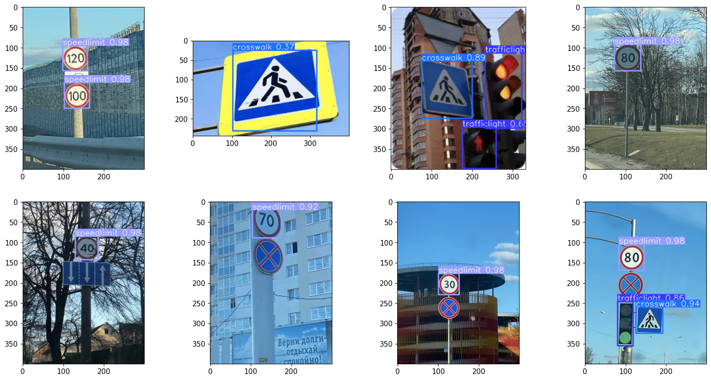

# Road Sign Detector

We can detect multiple types of Road Signs from the images using a pre-trained model named YOLOv5 (You Only Look Once)

This project is based upon YOLOv5.

---

You can clone YOLOv5 using

```
git clone https://github.com/ultralytics/yolov5.git
cd yolov5
pip install -r requirements.txt
```

The dataset used to test the model is made by Andrewmvd 

[https://www.kaggle.com/datasets/andrewmvd/road-sign-detection]()

---

#### Output sample


